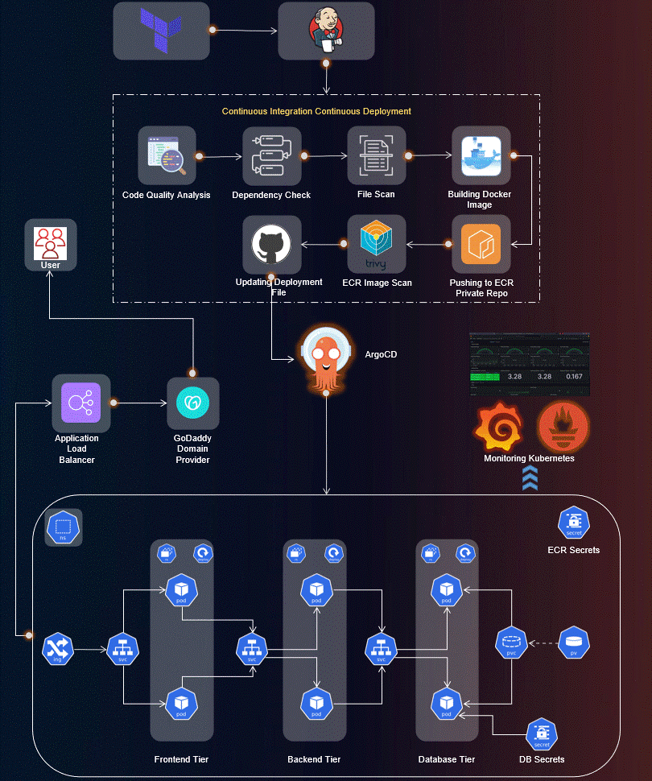
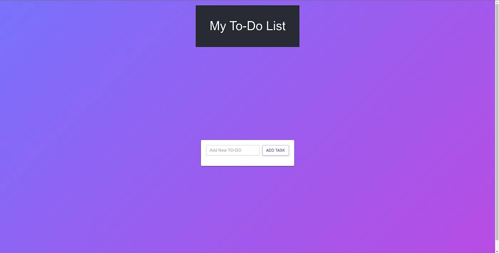
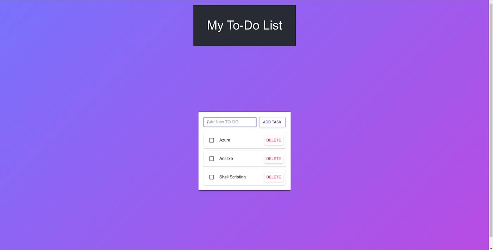

# MERN Stack Three-tier Application End-to-end DevsecOps Implementation.

**This project demonstrates an end-to-end DevOps implementation for deploying and managing a MERN stack three-tier application. The pipeline incorporates infrastructure setup, CI/CD processes, application deployment, and monitoring on AWS EKS (Elastic Kubernetes Service).**



## Project Overview:

1. **IAM User Setup:** Create an IAM user on AWS with the necessary permissions to facilitate deployment and management activities.

2. **Infrastructure as Code (IaC):** Use Terraform and AWS CLI to set up the Jenkins server (EC2 instance) on AWS.

3. **Jenkins Server Configuration:** Install and configure essential tools on the Jenkins server, including Jenkins itself, Docker, Sonarqube, Terraform, Kubectl, AWS CLI, and Trivy.

4. **EKS Cluster Deployment:** Utilize eksctl commands to create an Amazon EKS cluster, a managed Kubernetes service on AWS.

5. **Load Balancer Configuration:** Configure AWS Application Load Balancer (ALB) for the EKS cluster.

6. **Amazon ECR Repositories:** Create private repositories for both frontend and backend Docker images on Amazon Elastic Container Registry (ECR).

7. **ArgoCD Installation:** Install and set up ArgoCD for continuous delivery and GitOps.

8. **Sonarqube Integration:** Integrate Sonarqube for code quality analysis in the DevOps pipeline.

9. **Jenkins Pipelines:** Create Jenkins pipelines for deploying backend and frontend code to the EKS cluster.

10. **Monitoring Setup:** Implement monitoring for the EKS cluster using Helm, Prometheus, and Grafana.

11. **ArgoCD Application Deployment:** Use ArgoCD to deploy the Three-Tier application, including database, backend, frontend, and ingress components.

12. **DNS Configuration:** Configure DNS settings to make the application accessible via custom subdomains.

13. **Data Persistence:** Implement persistent volume and persistent volume claims for database pods to ensure data persistence.

14. **Monitoring:** Monitoring the EKS cluster’s performance using Grafana.

## Prerequisites:

- An AWS account with the necessary permissions to create resources.

- Terraform and AWS CLI installed on your local machine.

## Step 1: Create an IAM user and generate the AWS Access key

Create a new IAM User on AWS and give to it the `AdministratorAccess` for testing purposes (not recommended for your Organization's Projects)

- Go to the `AWS IAM Service` -> `Users` -> `Create user`.

    - Provide the name to your user and click on Next.
    
    - Select the Attach policies directly option and search for `AdministratorAccess` then select it.

- Now, Select your created user then click on `Security credentials` -> `Create access key`.

    - Select the Command Line Interface (CLI) then select the checkmark for the confirmation and click on Next.

    - Provide the Description and click on the Create access key.

## Step 2: Install Terraform & AWS CLI

Install & Configure Terraform and AWS CLI on your local machine to create Jenkins Server on AWS Cloud

### Terraform Installation

```bash
wget -O- https://apt.releases.hashicorp.com/gpg | sudo gpg - dearmor -o /usr/share/keyrings/hashicorp-archive-keyring.gpg

echo "deb [signed-by=/usr/share/keyrings/hashicorp-archive-keyring.gpg] https://apt.releases.hashicorp.com $(lsb_release -cs) main" | sudo tee /etc/apt/sources.list.d/hashicorp.list

sudo apt update

sudo apt install terraform -y
```

### AWSCLI Installation

```bash
curl "https://awscli.amazonaws.com/awscli-exe-linux-x86_64.zip" -o "awscliv2.zip"
sudo apt install unzip -y
unzip awscliv2.zip
sudo ./aws/install
```

### Configure Terraform

- Edit the file /etc/environment using the `sudo vim /etc/environment` command, add below lines and add your keys.

    ```
    export AWS_ACCESS_KEY_ID = <YOUR_AWS_ACCESS_KEY_ID>
    export AWS_SECRET_ACCESS_KEY = <YOUR_AWS_SECRET_ACCESS_KEY>
    export AWS_DEFAULT_REGION = <YOUR_AWS_DEFAULT_REGION>
    ```

- After doing the changes, restart your machine to reflect the changes of your environment variables.

### Configure AWS CLI

- Run the `aws configure` command, and add your keys

## Step 3: Deploy the Jenkins Server(EC2) using Terraform

```bash
# Clone the repository
git clone https://github.com/aqeeladil/mern-end-to-end-devops-implementation.git
cd Jenkins-Server-TF/

# Do some modifications to the `backend.tf` file such as changing the bucket name and dynamodb table(make sure you have created both manually on AWS Cloud).

# In `variables.tfvars`, you have to replace the key-name `my_key` as you have some other name for your Pem file.

# Initialize the backend
terraform init
terraform validate
terraform plan -var-file=variables.tfvars
terraform apply -var-file=variables.tfvars --auto-approve
```

## Step 4: Configure the Jenkins

```bash
# Access the Jenkins server.
ssh -i `my_key.pem` ubuntu@<instance-ip>

# Validate the installed services
jenkins --version
docker --version
docker ps
terraform --version
kubectl version
aws --version
trivy --version
eksctl --version

# Access Jenkins UI at <jenkins-server-public-ip>:8000

# Install suggested plugins
# Continue as admin
```

## Step 5: Deploy the EKS Cluster

1. Configure AWS CLI on Jenkins Server using `aws configure`.

2. Install plugins on Jenkins UI through `Manage Jenkins` > `Plugins` > `Available plugins`.

    - Install the following two plugins:

        - `AWS Credentials`

        - `Pipeline: AWS Steps`

    - Once, both the plugins are installed, restart your Jenkins service by checking the Restart Jenkins option.

    - Login to your Jenkins Server Again

3. Set AWS credentials on Jenkins

    - `Manage Plugins` > `Credentials` > `global`.

        - Kind: AWS Credentials
        - Scope: Global (Jenkins, node, items, child items, etc) 
        - ID: aws-key 
        - Description: aws-key

4. Add GitHub credentials if repository is Private.

    - Add the username and personal access token of your GitHub account

### Create an eks cluster

```bash
eksctl create cluster 
    --name Three-Tier-K8s-EKS-Cluster 
    --region us-east-1 
    --node-type t2.medium 
    --nodes-min 2 
    --nodes-max 2

aws eks update-kubeconfig --region us-east-1 --name Three-Tier-K8s-EKS-Cluster

# Verify
kubectl get nodes
```

## Step 6: Configure the Load Balancer on EKS because our application will have an ingress controller.

```bash
# Download the policy

curl -O https://raw.githubusercontent.com/kubernetes-sigs/aws-load-balancer-controller/v2.5.4/docs/install/iam_policy.json

# Create the IAM policy

aws iam create-policy 
    --policy-name AWSLoadBalancerControllerIAMPolicy 
    --policy-document file://iam_policy.json

# Create OIDC Provider

eksctl utils associate-iam-oidc-provider 
    --region=us-east-1 
    --cluster=Three-Tier-K8s-EKS-Cluster 
    --approve

# Create a Service Account

eksctl create iamserviceaccount 
    --cluster=Three-Tier-K8s-EKS-Cluster 
    --namespace=kube-system 
    --name=aws-load-balancer-controller 
    --role-name AmazonEKSLoadBalancerControllerRole --attach-policy-arn=arn:aws:iam::<your_account_id>:policy/AWSLoadBalancerControllerIAMPolicy 
    --region=us-east-1
    --approve 
```
```bash
# Deploy the AWS Load Balancer Controller

sudo snap install helm --classic
helm repo add eks https://aws.github.io/eks-charts
helm repo update eks

helm install aws-load-balancer-controller eks/aws-load-balancer-controller 
    -n kube-system 
    --set clusterName=my-cluster 
    --set serviceAccount.create=false 
    --set serviceAccount.name=aws-load-balancer-controller

# Verify
kubectl get deployment -n kube-system aws-load-balancer-controller

# If the pods are getting Error or CrashLoopBackOff, use the below command

helm upgrade -i aws-load-balancer-controller eks/aws-load-balancer-controller \
  --set clusterName=my-cluster \
  --set serviceAccount.create=false \
  --set serviceAccount.name=aws-load-balancer-controller \
  --set region=us-east-1 
  --set vpcId=<vpc#> 
  -n kube-system
```

# Step 7: Create Amazon ECR Private Repositories for both Tiers (Frontend & Backend)

- Using the Aws Management Console, create two private repositories on Aws ECR.

- Configure ECR locally on Jenkins Server because we have to upload our images to Amazon ECR.

## Step 8: Install & Configure ArgoCD

```bash
kubectl create namespace three-tier

# As you know, Our two ECR repositories are private. So, when we try to push images to the ECR Repos it will give us the error `Imagepullerror`. To get rid of this error, we will create a secret for our ECR Repo by the below command and then, we will add this secret to the deployment file.

# Note: The Secrets are coming from the `.docker/config.json` file which is created while login the ECR in the earlier steps

kubectl create secret generic ecr-registry-secret \
  --from-file=.dockerconfigjson=${HOME}/.docker/config.json \
  --type=kubernetes.io/dockerconfigjson --namespace three-tier

kubectl get secrets -n three-tier

# Install argoCD.

kubectl create namespace argocd

kubectl apply -n argocd -f https://raw.githubusercontent.com/argoproj/argo-cd/v2.4.7/manifests/install.yaml

# Verify

kubectl get pods -n argocd

# Expose the argoCD server as LoadBalancer

kubectl patch svc argocd-server -n argocd -p '{"spec": {"type": "LoadBalancer"}}'

# You can validate whether the Load Balancer is created or not by going to the AWS Console

# To access the argoCD, copy the LoadBalancer DNS and hit on your favorite browser.

# Get the password for argoCD server to perform the deployment.

sudo apt install jq -y

export ARGOCD_SERVER='kubectl get svc argocd-server -n argocd -o json | jq - raw-output '.status.loadBalancer.ingress[0].hostname''

export ARGO_PWD='kubectl -n argocd get secret argocd-initial-admin-secret -o jsonpath="{.data.password}" | base64 -d'

echo $ARGO_PWD

# Enter the username and password in argoCD and click on SIGN IN.
```

## Step 9: Configure Sonarqube for DevOps Pipeline

1. Access Sonarqube at `http://<jenkins-server-public-ip>:9000/`

    - The username and password will be admin

    - Update the password

2. `Administration` -> `Security` -> `Users` -> `Update tokens` -> `Generate`

    - Copy the token & keep it somewhere safe.

3. Configure webhooks for quality checks.

    - `Administration` -> `Configuration` -> `Webhooks` -> `Create`

        - Name: jenkins
        - URL: `http://<jenkins-server-public-ip>:8080/sonarqube-webhook/`

4. Create a Project for frontend code.

    - `http://<jenkins-server-public-ip>:9000/projects/create`

    - Click on `Manually`

        - Project display name: three-tier-frontend
        - Project key: three-tier-frontend
        - Branch: main

    - `Setup` -> `Locally` -> `Use existing token` -> `Continue` -> `Other and Linux as OS`.

    - Copy the provided command and use it in the Jenkins Frontend Pipeline where Code Quality Analysis will be performed.

5. Create a Project for backend code.

    - `http://<jenkins-server-public-ip>:9000/projects/create`

    - Click on `Manually`

        - Project display name: three-tier-backend
        - Project key: three-tier-backend
        - Branch: main

    - `Setup` -> `Locally` -> `Use existing token` -> `Continue` -> `Other and Linux as OS`.

    - Copy the provided command and use it in the Jenkins Backend Pipeline where Code Quality Analysis will be performed.

6. Store the sonar credentials in Jenkins.

    - `Dashboard` -> `Manage Jenkins` -> `Credentials` -> `Global`.   

        - Kind: Secret text
        - Scope: Global (Jenkins, node, items, child items, etc) 
        - ID: sonar-token
        - Description: sonar-token

7. Store the GitHub Personal access token to push the deployment file which will be modified in the pipeline itself for the ECR image.

    - `Dashboard` -> `Manage Jenkins` -> `Credentials` -> `Global`.   

        - Kind: Secret text
        - Scope: Global (Jenkins, node, items, child items, etc) 
        - ID: github
        - Description: github

8. Add Aws Account ID in the Jenkins credentials because of the ECR repo URI.

    - `Dashboard` -> `Manage Jenkins` -> `Credentials` -> `Global`.   

        - Kind: Secret text
        - Scope: Global (Jenkins, node, items, child items, etc) 
        - ID: ACCOUNT_ID
        - Description: ACCOUNT_ID

9. Provide the ECR image name for frontend which is `frontend` only.

    - `Dashboard` -> `Manage Jenkins` -> `Credentials` -> `Global`.   

        - Kind: Secret text
        - Scope: Global (Jenkins, node, items, child items, etc) 
        - ID: ECR_REPO1
        - Description: ECR_REPO1

10. Provide our ECR image name for the backend which is `backend` only.

    - `Dashboard` -> `Manage Jenkins` -> `Credentials` -> `Global`.   

        - Kind: Secret text
        - Scope: Global (Jenkins, node, items, child items, etc) 
        - ID: ECR_REPO2
        - Description: ECR_REPO2

## Step 10: Install the required plugins and configure the plugins to deploy Three-Tier Application

`Dashboard` -> `Manage Jenkins` -> `Plugins` -> `Available Plugins`
```bash
Docker
Docker Commons
Docker Pipeline
Docker API
docker-build-step
Eclipse Temurin installer
NodeJS
OWASP Dependency-Check
SonarQube Scanner
```

1. Configure the installed plugins:** 

    - `Dashboard` -> `Manage Jenkins` -> ``Tools`

        - Search for jdk and provide the configuration details.

        - Search for the sonarqube scanner and provide the configuration details.

        - Search for node and provide the configuration details.

        - Search for Dependency-Check and provide the configuration details.

        - Search for docker and provide the configuration details.

2. Set the path for Sonarqube in Jenkins.

    - `Dashboard` -> `Manage Jenkins` -> `System` -> `SonarQube installations`

        - Name: sonar-server
        - Server URL: `http://<jenkins-server-public-ip>:9000/`
        - Server Auth Token: sonar-token

3. Create Jenkins Pipeline to deploy the Backend Code.

    - `Jenkins Dashboard` -> `New Item` -> `Pipeline`   
        
        - Name: Three-Tier-Backend-Application

        - Copy paste the code from `Jenkins-Pipeline-Code/Jenkinsfile-Backend`.

        - Click on the `Build Now`.

4. Create Jenkins Pipeline to deploy the Frontend Code.

    - `Jenkins Dashboard` -> `New Item` -> `Pipeline`   
        
        - Name: Three-Tier-Frontend -Application

        - Copy paste the code from `Jenkins-Pipeline-Code/Jenkinsfile-Frontend `.

        - Click on the `Build Now`.

## Step 11: Set up Monitoring for EKS Cluster.

```bash
helm repo add stable https://charts.helm.sh/stable

# helm repo add prometheus-community https://prometheus-community.github.io/helm-charts
# helm install prometheus prometheus-community/prometheus
# helm repo add grafana https://grafana.github.io/helm-charts
# helm repo update
# helm install grafana grafana/grafana

helm repo add prometheus-community https://prometheus-community.github.io/helm-charts

helm install stable prometheus-community/kube-prometheus-stack

kubectl get svc

# Access the Prometheus and Grafana consoles from outside of the cluster.
# Change the Service type from ClusterType to LoadBalancer

kubectl edit svc stable-kube-prometheus-sta-prometheus

kubectl edit svc stable-grafana

# Verify 
kubectl get svc
# you will see the LoadBalancers DNS names
# You can also validate from your console.
```

- Access Prometheus Dashboar at `<Prometheus-LB-DNS>:9090`.

    - `Status` -> `Target`.

    - You will see a lot of Targets

- Access Grafana Dashboard at `<Grafana-LB-DNS> (admin/prom-operator).

    - `Data Source` -> `Prometheus`

        - In the Connection, paste your <Prometheus-LB-DNS>:9090.

        - If the URL is correct, then you will see a green notification/

- On Grafana, create a dashboard to visualize Kubernetes Cluster Logs.

    - `Dashboard` -> `New` -> `Import` -> 

        - Provide 6417 ID and click on Load

        - `6417` is a unique ID from Grafana which is used to Monitor and visualize Kubernetes Data

    - Select the data source that you have created earlier and click on Import.

    - You can view your Kubernetes Cluster Data.

## Step 11: Deploy Three-Tier Application using ArgoCD.

1. Configure the Private Repository in ArgoCD.

    - `Settings` -> `Repositories` -> `CONNECT REPO USING HTTPS` -> 

    - Provide the repository name where your Manifests files are present.

    - Provide the username and GitHub Personal Access token and click on CONNECT.

    - If your Connection Status is Successful it means repository connected successfully.

2. Create argocd applications for the database, backend, frontend and ingress.

    - Once your Ingress application is deployed. It will create an Application Load Balancer

3. Now, Copy the ALB-DNS and go to your Domain Provider 

    - Go to DNS and add a CNAME type with hostname backend then add your ALB in the Answer and click on Save.

4. Now, you can see your Grafana Dashboard to view the EKS data such as pods, namespace, deployments, etc.

5. We have configured the Persistent Volume & Persistent Volume Claim. So, if the pods get deleted then, the data won’t be lost. The Data will be stored on the host machine.






